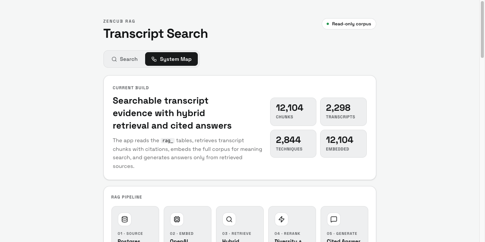

# ZenCub RAG

[](https://github.com/eatusc/zencub-rag/actions/workflows/ci.yml)

ZenCub RAG answers questions about a BJJ (Brazilian Jiu-Jitsu) video library with citations back to the exact clips, built on LangGraph with persistent checkpointed workflows.



**Live demo: [zencub-rag.vercel.app](https://zencub-rag.vercel.app)**

## Engineering highlights

- Strict TypeScript with zero `any` across roughly 8,800 lines of application code; `tsc --noEmit` runs in CI.
- LangGraph workflows on a Postgres checkpointer: `interrupt()`-based human approval gates, checkpoint cloning into separate branch threads for model experiments, and selective branch recovery backed by a server-only idempotency cache so only failed branches re-execute.
- Capability tokens for checkpoint replay are stored only as SHA-256 hashes; the checkpoint API requires the capability, never enumerates threads, and redacts private state.
- Committed retrieval eval reports in [docs/evals/](docs/evals/), currently 19/19 passing.

## What it does

- Hybrid retrieval over transcript chunks: Postgres full-text search plus pgvector semantic search, fused with Reciprocal Rank Fusion, with LLM reranking and per-video diversity caps (helpers in `src/lib/ragRetrieval.ts`)
- Cited answers through `/api/rag/ask`, grounded in timestamped source clips and enriched with overlapping technique metadata
- Opt-in LangGraph follow-ups that classify topic continuity, retrieve context, and validate citations
- Instructor Compare (`/api/rag/instructor-compare`): parallel evidence retrieval, human panel approval, one independent analysis branch per instructor, cross-instructor synthesis, and per-claim citation verification, all on durable checkpoint threads
- All database access is server-side against a read-only Supabase dataset; secrets never reach the browser

The home page has six tabs:

- `Search`: keyword and semantic search, result analysis, Ask with citations, and Classic or LangGraph follow-ups
- `In App Experience`: answer-first presentation using the same server-side providers
- `Instructor Compare`: guided multi-instructor research with evidence loops, clip review pauses, recovery, and model-experiment branches
- `System Map`: visual explanation of the RAG data flow and table roles
- `Lang Tests`: live Classic versus LangGraph comparisons, approval and recovery labs, and authorized checkpoint timeline/replay controls
- `Langfuse`: recent LLM traces (latency, cost, LangGraph node tree) from a self-hosted Langfuse instance

| Search | System Map |
| --- | --- |
|  |  |

## Setup

Requires Node 22 or newer.

```bash
npm install
cp .env.example .env.local   # then fill in the values
npm run dev
```

To use your own data, follow [Bring Your Own Database](docs/BRING_YOUR_OWN_DATABASE.md). It covers the fresh Supabase bootstrap migration, import order and JSON contracts, embedding backfill, and RLS rules. This repository does not include the author's database contents.

### Environment variables

Every variable is documented in [.env.example](.env.example). Summary:

| Variables | Purpose |
| --- | --- |
| `NEXT_PUBLIC_SUPABASE_URL`, `NEXT_PUBLIC_SUPABASE_ANON_KEY`, `SUPABASE_SERVICE_ROLE_KEY` | Supabase access; the service-role key stays server-side |
| `OPENAI_API_KEY`, `OPENROUTER_API_KEY` | Model providers |
| `RAG_ANALYZE_MODEL`, `RAG_ANSWER_MODEL`, `RAG_EMBEDDING_MODEL`, `RAG_RERANK_MODEL`, `RAG_RERANK` | Analysis, answer, embedding, and reranking models |
| `RAG_OPENROUTER_MODEL`, `RAG_OPENROUTER_BASE_URL` | OpenRouter model and endpoint |
| `RAG_QWEN_BASE_URL`, `RAG_QWEN_MODEL` | Local model served through an OpenAI-compatible endpoint (for example Ollama) |
| `RAG_CLAUDE_BIN`, `RAG_CLAUDE_MODEL` | Optional local Claude Code CLI provider |
| `LANGFUSE_PUBLIC_KEY`, `LANGFUSE_SECRET_KEY`, `LANGFUSE_BASEURL` | Optional Langfuse tracing; tracing is skipped when unset |
| `LANGGRAPH_DATABASE_URL`, `LANGGRAPH_CHECKPOINT_SCHEMA`, `LANGGRAPH_TEST_MODE` | LangGraph persistence; the URL must be a direct Postgres/pooler connection, not the Supabase HTTP URL |
| `RAG_TEST_PROJECT_REF` | Safety guard: `embed:chunks` refuses to write unless the Supabase host matches |

API routes own all database and model access; the browser never receives service-role or model-provider keys.

### Database migrations

Run the files in [docs/migrations/](docs/migrations/) in the Supabase SQL editor, in this order:

| # | Migration | Purpose |
| --- | --- | --- |
| 1 | `2026-07-17-rag-core-bootstrap.sql` | Fresh core schema (bring-your-own-database setups only) |
| 2 | `2026-07-07-hybrid-rrf-index-cleanup.sql` | Database-side retrieval upgrades for hybrid search |
| 3 | `2026-07-14-search-logging.sql` | Server-only search history logging |
| 4 | `2026-07-15-followup-experiments.sql` | Optional LangGraph follow-up telemetry |
| 5 | `2026-07-17-langgraph-persistence.sql` | LangGraph checkpoint namespace; then run `npm run langgraph:setup` once |
| 6 | `2026-07-17-langgraph-approval-recovery.sql` | Approval notes and recovery-test tables (test mode) |
| 7 | `2026-07-17-langgraph-checkpoint-replay.sql` | Replay capability registry (token hashes only) |
| 8 | `2026-07-17-instructor-compare-history.sql` | Durable Instructor Compare result history |
| 9 | `2026-07-17-instructor-compare-workflows.sql` | Multi-turn indexing and the branch idempotency cache |

The write/recovery/replay APIs return 403 while `LANGGRAPH_TEST_MODE=off`; keep it off outside an intentional local test environment.

## Testing and evals

```bash
npm run typecheck   # strict TypeScript
npm run lint        # ESLint
npm test            # vitest unit tests for the retrieval helpers
npm run eval:queries
```

`eval:queries` runs 20 BJJ queries (listed in [docs/TEST_QUERIES.md](docs/TEST_QUERIES.md)) through the live `/api/rag/search` API and checks result counts, expected terms, citations, and source URLs. The latest committed report is [docs/evals/rag-search-eval.md](docs/evals/rag-search-eval.md).

LangGraph acceptance tests (persistence across restarts, approval, recovery, replay, instructor compare) are described in [docs/LANGGRAPH_TEST_PLAN.md](docs/LANGGRAPH_TEST_PLAN.md) and run through the `npm run test:langgraph-*` and `npm run test:instructor-compare` scripts against a local dev server. The integration scripts target `http://localhost:3000` by default; set `RAG_BASE_URL` to point elsewhere.

`npm run embed:chunks -- --limit=2048` backfills embeddings (dry-run by default; add `--apply` to write).

## More documentation

- Architecture: [docs/ARCHITECTURE.md](docs/ARCHITECTURE.md)
- How the RAG pipeline works: [docs/RAG_TECHNOLOGY.md](docs/RAG_TECHNOLOGY.md)
- Bring your own database: [docs/BRING_YOUR_OWN_DATABASE.md](docs/BRING_YOUR_OWN_DATABASE.md)
- LangGraph test plan: [docs/LANGGRAPH_TEST_PLAN.md](docs/LANGGRAPH_TEST_PLAN.md)
- Development log: [docs/DEVLOG.md](docs/DEVLOG.md)

## License

MIT, see [LICENSE](LICENSE).
